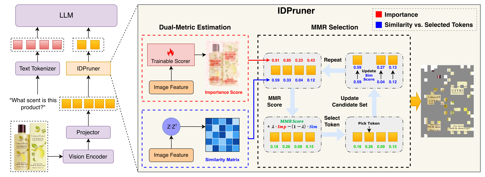

# IDPruner: Harmonizing Importance and Diversity in Visual Token Pruning for MLLMs

**IDPruner** is a novel, one-shot visual token pruning framework designed to accelerate MLLM inference by harmonizing two critical metrics: **Importance** and **Diversity**. 

---

### 📝 To-do list

- [x] Release core MMR algorithm code
- [x] Release model adapters (Qwen2.5-VL, LLaVA-OV, LLaVA-1.5)
- [x] Release evaluation scripts
- [x] Release inference example
- [x] Release pre-trained importance scorer weights

---

### 👀 Overview

Existing pruning methods either focus on saliency (missing background context) or semantic coverage (retaining irrelevant noise). IDPruner reformulates token selection as a re-ranking problem using the **Maximal Marginal Relevance (MMR)** algorithm to achieve a Pareto-optimal balance.

#### Key Technical Innovations:
*   **Pareto-optimal Balance**: Explicitly models the trade-off between importance (via a trainable scorer) and redundancy (via feature similarity).
*   **Attention-Map-Free**: IDPruner does not require full attention matrices, ensuring 100% compatibility with **FlashAttention** and high-performance kernels.
*   **One-Shot Efficiency**: Operates as a plug-and-play module during the early stage of inference. This design makes it **highly compatible with various inference engines and frameworks (e.g., vLLM)**, with a pruning overhead that is negligible compared to the model's forward pass.
*   **Superior Robustness**: Maintains **95.18%** performance on Qwen2.5-VL-7B at a 75% pruning ratio, outperforming SOTA baselines including **VisionSelector**, VisionZip, and SCOPE.



---

### 💻 Core Implementation

The core MMR-based pruning strategy is implemented in:
👉 **[`pruning/strategies/idpruner.py`](pruning/strategies/idpruner.py)**

This file contains the `idpruner` function which executes the iterative MMR selection process described in our work.

---

### 🔧 Installation

#### 1. Environment Setup
We recommend using Python 3.10+ and a dedicated environment.

```bash
conda create -n idpruner python=3.10 -y
conda activate idpruner
```

#### 2. Dependencies
Install the required packages:

```bash
pip install -r requirements.txt
```

#### 3. Evaluation Framework
Install `lmms-eval` to reproduce the benchmark results:

```bash
git clone https://github.com/EvolvingLMMs-Lab/lmms-eval
cd lmms-eval
pip install -e ".[all]"
```

---

### 🚀 Quick Start

#### 1. Inference Example
Test the IDPruner plugin with a single image using Qwen2.5-VL:
```bash
python example/run_idpruner_example.py
```

#### 2. Automated Evaluation
We provide a robust shell script `run_serial_eval.sh` to benchmark various tasks and pruning ratios serially across different architectures.

**Command Format:**
```bash
bash run_serial_eval.sh <gpu_id> <model_name> "<ratio_list>" <method_key_1> [method_key_2 ...]
```

**Available Options:**
*   **Model Names**: 
    * `Qwen2.5-VL-3B-Instruct`, `Qwen2.5-VL-7B-Instruct`
    * `llava-1.5-7b-hf`, `LLaVA-OneVision-1.5-8B-Instruct`
*   **Pruning Method Keys**:
    * `idpruner_lambda0.5` (Our proposed IDPruner with $\lambda=0.5$)
    * `vision_selector` (Importance-only baseline)
    * `divprune` (Diversity-only baseline)
    * `baseline` (Original model without pruning)
    * `vispruner`, `scope`, `hiprune`, `visionzip` (Other SOTA methods)
*   **Supported Benchmarks**:
    * `textvqa`, `mme`, `pope`, `docvqa`, `scienceqa_img`, `ocrbench`, `mmstar`, `chartqa`, `ai2d`, `mmbench_en_dev`, `mmbench_cn_dev`

**Example Command:**
To evaluate IDPruner on Qwen2.5-VL-7B with 75% and 90% pruning ratios on GPU 0:
```bash
bash run_serial_eval.sh 0 "Qwen2.5-VL-7B-Instruct" "0.75 0.9" idpruner_lambda0.5
```

---

### 📊 Support Matrix

| Model Family        | Specific Versions | Adapter Path                               |
| :------------------ | :---------------- | :----------------------------------------- |
| **Qwen2.5-VL**      | 3B / 7B Instruct  | `pruning/adapters/qwen2_5_vl_adapter.py`   |
| **LLaVA-1.5**       | 7B                | `pruning/adapters/llava_adapter.py`        |
| **LLaVA-OneVision** | 8B                | `pruning/adapters/llava_ov_1_5_adapter.py` |

---

### 🏅 Acknowledgement

This project is built upon the foundational contributions of several excellent open-source projects and inspirational methods.

#### Foundational Platforms
- **Models**: [Qwen2.5-VL](https://github.com/QwenLM/Qwen-VL) & [LLaVA](https://github.com/haotian-liu/LLaVA)
- **Evaluation**: [lmms-eval](https://github.com/EvolvingLMMs-Lab/lmms-eval)

#### Inspirational Methods
We express our sincere gratitude to the developers of the following visual token pruning methods, which were instrumental in the development and evaluation of **IDPruner**:
- [VisionSelector](https://github.com/JulietChoo/VisionSelector)
- [VisionZip](https://github.com/JIA-Lab-research/VisionZip)
- [FastV](https://github.com/pkunlp-icler/FastV)
- [VisPruner](https://github.com/Theia-4869/VisPruner)
- [SCOPE](https://github.com/kinredon/SCOPE)
- [HiPrune](https://github.com/Danielement321/HiPrune)
- [divprune](https://github.com/vbdi/divprune)
- [DART](https://github.com/ZichenWen1/DART)